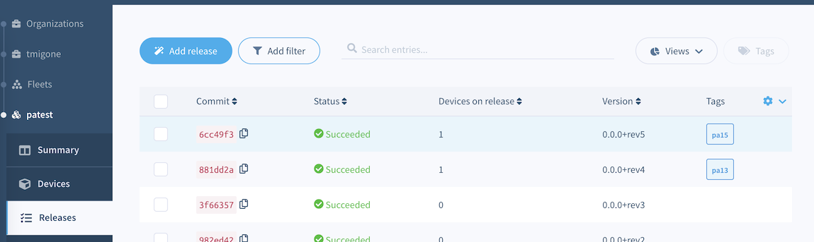
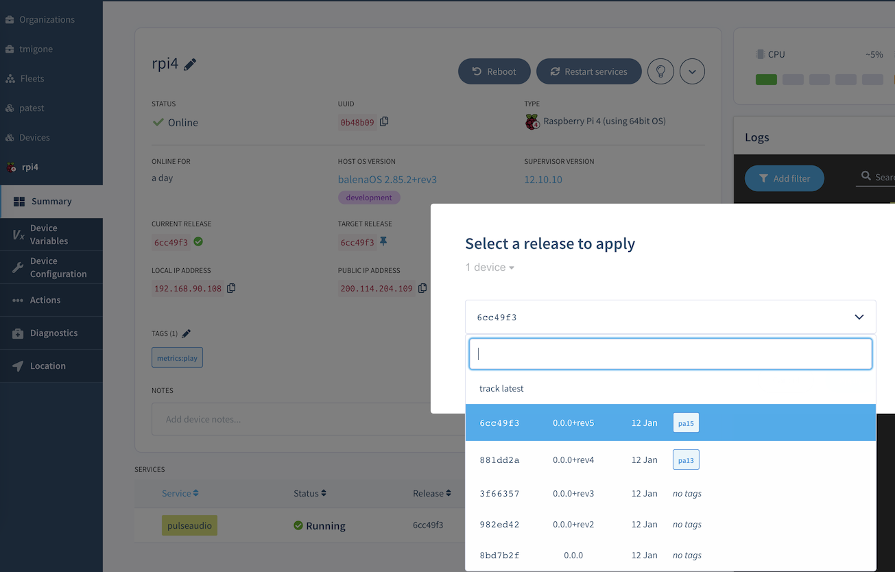

# PulseAudio test environment

Easy setup for testing PulseAudio applications.

Supported PulseAudio versions:
- PulseAudio v13
- PulseAudio v15

Supported device types:
- Raspberry Pi 4

## Prerequisites

1. Register on https://www.balena.io/
2. Create a fleet on https://dashboard.balena-cloud.com/
  - Fleet name: `patest` (or any name you like)
  - Device type: Raspberry Pi 4
3. Install [balena-cli](https://github.com/balena-io/balena-cli/blob/master/INSTALL.md)

## Usage
### 1. Create PulseAudio releases

The `test/e2e/deploy-to-balena.sh` script will create and tag releases for all available PulseAudio versions. Run it manually with:

```bash
chmod +x test/e2e/deploy-to-balena.sh
./test/e2e/deploy-to-balena.sh
```

Once the script is done, you should see the releases listed on the `Releases` page on your fleet, notice the tags indicating the PulseAudio version:


### 2. Provision devices

You'll need to provision one device for each version of PulseAudio you want to setup. Click `Add device` on the `Summary` or `Devices` page on your fleet in balenaCloud and follow the instructions.

### 3. Pin devices to a release

Lastly, you'll need to pin the devices to the releases you created. Here is a [quick guide](https://www.balena.io/docs/learn/deploy/release-strategy/release-policy/#pin-device-to-a-release) on how to do it. Make sure you pin one device for each different release (PulseAudio version) you are interested in.

